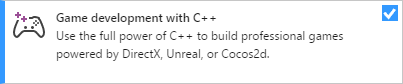
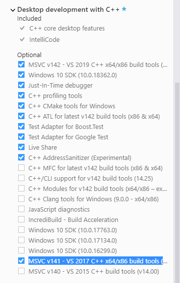
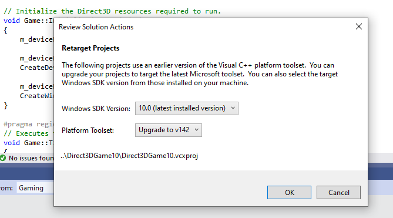

# Visual Studio 2019 support notes

This topic describes Microsoft Game Development Kit (GDK) support for Visual Studio 2019. Visual Studio 2019 [version 16.7, version 16.9](/visualstudio/releases/2019/servicing), and the latest update are supported for Microsoft Game Development Kit (GDK) development.

> Visual Studio 2019 version 16.0 is out of support as of January 2021. 16.4 support ended in October 2021. You can install older releases of Visual Studio 2019 per the instructions on [Microsoft Docs](/visualstudio/releases/2019/history#installing-an-earlier-release).

## Installing Visual Studio 2019  

When installing Visual Studio 2019, you must select the **Game Development with C++** workload during setup as shown in the following screenshot.  



In addition to the core C++ tools that you need for Windows PC game development, Game Development with C++ also includes the version of the Windows 10 SDK that's needed to build Windows PC games with the Microsoft Game Development Kit (GDK).

While it's not required, installing the Desktop development with C++ workload provides additional tools and samples that you might find helpful.

Depending on your needs, you can choose to install additional optional workloads or components.

* If you're building a game that uses Unity, install the **Game Development with Unity** workload.

* Version **v142** of the MVSC build tools is installed with the Game Development with C++ workload. If needed, you can use the Visual Studio 2019 integrated development environment (IDE) with the MSVC tools that were included in Visual Studio 2017 (**v141**).  Using the newer IDE without upgrading to the new toolset enables you to take advantage of the new IDE features without having to update your source code to work with the new compiler. To use the Visual Studio 2017 toolset with the Visual Studio 2019 IDE, install the **MSVC v141 - VS 2017 C++ x64/x86 build tools (v14.16)** component under the **Desktop development with C++** workload as shown in the following screenshot.



* To debug your game on a remote PC, see [Configure remote debugging](../../get-started-with-pc-dev/config-test-pc-software/gr-debugging-with-vs-remote.md) for instructions about installing the Visual Studio Remote Tools.

## Migrating existing Visual Studio 2017 projects to Visual Studio 2019  

In most cases, the upgrade wizard that's provided with Visual Studio can migrate your project to Visual Studio 2019 without any other changes. When you open a Visual Studio 2017 project in Visual Studio 2019, you see the following Review Solution Actions dialog box that prompts you to upgrade. To upgrade the project, select **OK**.  

   

You can also choose to use the Visual Studio 2019 IDE without upgrading your build tools. To do so, select **Cancel** in the **Review Solution Actions** dialog box.

> [!NOTE]
> To use the Visual Studio 2017 tools with the Visual Studio 2019 IDE, you must select the optional component **MVSC v141 - VS 2017 C++ build tools** from the Visual Studio 2019 setup steps.

### Manually upgrading projects to Visual Studio 2019  

If you want to upgrade your project by directly editing your project files (.vcxproj), you need to make the following changes.  

1. Add `WindowsTargetPlatformVersion` to the `Globals` property group. Set its value to 10.0. The following is an example.  

    ```xml
      <PropertyGroup Label="Globals">
        <WindowsTargetPlatformVersion>10.0</WindowsTargetPlatformVersion>
        ...
    ```

1. Change all instances of `PlatformToolset` from v141 to v142. The following is an example.   

    ```xml
    <PlatformToolset>v141</PlatformToolset>
    ...
    <PlatformToolset>v142</PlatformToolset>  
    ```

1. Rebuild the project.   

### clang/LLVM for Windows (ClangCl) project support

Visual Studio 2019 also supports clang/LLVM for Windows development. This requires installing **C++ Clang-cl for Windows** and **C++ Clang-cl for v142 build tools (x64/x86)** which are individual components.

See the [Microsoft Game Development Kit (GDK)](gr-vs-clang.md) Clang topic and the [Microsoft Docs](/cpp/build/clang-support-msbuild?view=msvc-160) for more information.

## Known issues

* DirectXMath *IsNan functions can fail with Visual Studio 2019 when built with `/fp:fast`. The fix is to use Visual Studio 2019 (16.3 or later) with DirectXMath 3.14 or later. Otherwise, you can work around the issue by placing `#pragma float_control` statements around the use of those functions.

* Use of precompiled headers have a number of problems in clang/LLVM for Windows prior to v11. clang v11 is included in VS 2019 (16.9). Depending upon your PCH and C++ template usage, you may need to add ``-fno-pch-instantiate-templates`` to successfully build.

* [.NET Core updates delivered through Microsoft Update](https://devblogs.microsoft.com/dotnet/net-core-updates-coming-to-microsoft-update/) can block Microsoft Game Development Kit (GDK) installation. To resolve this issue, update your Visual Studio instance or uninstall the Microsoft.NET.Core.Component.SDK.2.1 component through the Visual Studio Installer then retry (un)installing the Microsoft Game Development Kit (GDK).

## Reporting bugs

Bug reports for the **Visual C++ compiler** should be reported (if possible) via Visual Studio _Report a Problem..._. See [Microsoft Docs](/visualstudio/ide/how-to-report-a-problem-with-visual-studio) and the [Developer Community](https://aka.ms/feedback/report?space=62) website. Be sure to read [this page](https://aka.ms/compilerbug) for details on creating a good bug report for the compiler.

> [!NOTE]
> You can add a comment to a public report issue marked as "Microsoft only" if additional NDA information is required to reproduce the issue.

For bug reporting for the **clang/LLVM for Windows compiler**, use https://bugs.llvm.org/

For bug reports for the **Microsoft Standard C++ Library** (a.k.a. STL), use https://github.com/microsoft/STL/issues

## See also

[Visual Studio for PC Game Development](gr-visualstudio-toc.md)
