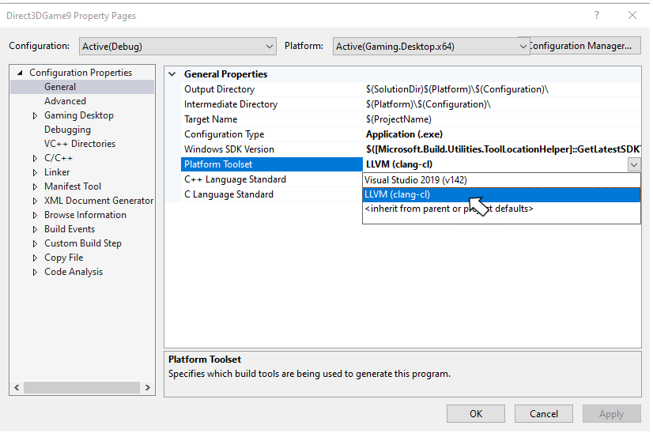
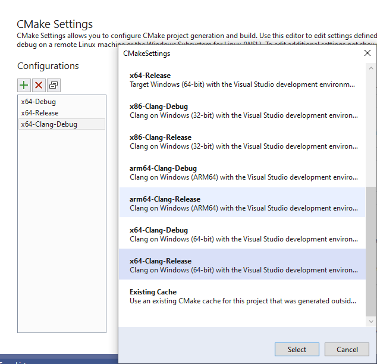
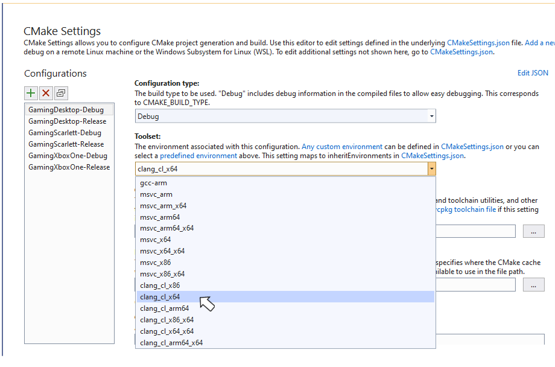

# Using Clang/LLVM with the Microsoft Game Development Kit

Development of Microsoft Game Development Kit (GDK) titles using Clang/LLVM is officially supported using Visual Studio 2019 or 2022 and the *clang/LLVM for Windows* toolset v11 or later. This toolset uses the Visual C/C++ Runtime (the Universal CRT library + the Microsoft STL). Other toolsets and runtime combinations may or may not successfully run or pass title certification.

Using Clang/LLVM with Visual Studio 2017 is not supported.

Clang/LLVM for Windows with the **LLVM (clang-cl)** (i.e. the ClangCL) Platform Toolset uses the [Microsoft Standard C++ Library](https://github.com/microsoft/STL).

| Clang Version | Visual Studio Update|
|---|---|
| clang v11 | Visual Studio 2019 (16.9) |
| clang v12 | Visual Studio 2019 (16.11) |
| clang v12 | Visual Studio 2022 (17.0) |
| clang v13 | Visual Studio 2022 (17.1) |

## Required Visual Studio versions and components

Visual Studio version 16.7 or later is required to use Clang/LLVM with the Microsoft Game Development Kit (GDK).  The **C++ Clang Tools for Windows** component under **Desktop Development with C++** must be selected when installing Visual Studio 2019.


Depending on which version of Visual Studio you are using the required Clang/LLVM components may be named **C++ Clang Compiler for Windows** and **C++ Clang-cl for v142 build tools (x64/x86)**.

 **NOTE:** If you modify your existing Visual Studio installation to add the **C++ Clang Tools for Windows** after the Microsoft Game Development Kit (GDK) has been installed, you'll need to repair your Microsoft Game Development Kit (GDK) installation before using Clang/LLVM.

If the **C++ Clang Tools for Windows** component has been installed, Microsoft Game Development Kit (GDK) setup will install support for the **ClangCl** platform toolset for the ``Gaming.Desktop.x64`` platforms.

## Compiler and Linker switches

For the ``Gaming.Desktop.x64`` platforms, the clang/LLVM command-line used with ``clang-cl.exe`` will always include:

  ```
  -Wno-c++98-compat -Wno-c++98-compat-pedantic -Wno-reserved-id-macro
  -Wno-pragma-pack -Wno-unknown-pragmas
  -Wno-unused-command-line-argument
  ```

## Supported CPU intrinsics

Clang/LLVM & GNUC treat SSE SIMD types differently than Visual C++ & the Intel Compiler. Specifically, the __m128, __m128i, __m128d types are considered opaque types rather than structs, so you cannot create C++ overloaded functions using those types. This also means direct element access via __m128.m128_f32[] will not compile on clang.

Note that for DirectXMath on Clang/LLVM, this results in all the XMVECTOR C++ overloads being disabled. You can also opt-in to this behavior on Visual C++ as well for better portability by defining the preprocessor symbol ``XM_NO_XMVECTOR_OVERLOADS`` before including the DirectXMath headers.

For PC, you can count on SSE and SSE2 to be supported by all x64 native CPUs as this is part of the architecture definition. You can also safely require SSE3 as this is supported by all modern CPUs supported by Windows 10. For DirectXMath, this means you can define the preprocessor define ``_XM_SSE3_INTRINSICS_`` and must build with clang/LLVM using ``-march=sse3``.

Visual C++ will allow you to use advanced instruction intrinsics even if you are not currently building with /arch:AVX or /arch:AVX2, but clang/LLVM will fail to build in this scenario without the proper complier switches. Be sure to do runtime CPU support checks for anything you use beyond SSE2 on PC.

DirectXMath in the Windows 10 SDK (18363) or earlier used the wrong CPUID intrinsics to implement ``XMVerifyCPUSupport`` for Clang/LLVM. This is fixed for DirectXMath 3.14 in the Window 10 SDK (19041) or later.
* [https://walbourn.github.io/directxmath-3.14/](https://walbourn.github.io/directxmath-3.14/)

## Using Clang/LLVM with msbuild

To use Clang/LLVM with an msbuild project, set the **Platform Toolset** to “LLVM (clang-cl)”.  **Platform Toolset** can be found under the **General** tab in the Visual C++ project properties dialog as shown in the following figure.



The Clang/LLVM toolset can also be set by directly setting the **PlatformToolset** msbuild property to **ClangCl** as shown in the following example.

```xml

<PlatformToolset>ClangCl</PlatformToolset>

```
By default, the Clang/LLVM compiler generates significantly more informational warnings compared to MSVC. Therefore for the ‘TODO’ places you will see both the -W#pragma-messages output as a warning, and an -Wunused-value warning:

```
1>Game.cpp(56,13): warning : Game.cpp: TODO in Update [-W#pragma-messages]
1>Game.cpp(58,5): warning : expression result unused [-Wunused-value]
1>Game.cpp(79,13): warning : Game.cpp: TODO in Render [-W#pragma-messages]
1>Game.cpp(81,5): warning : expression result unused [-Wunused-value]
1>Game.cpp(137,13): warning : Game.cpp: TODO in CreateDeviceDependentResources [-W#pragma-messages]
1>Game.cpp(139,5): warning : expression result unused [-Wunused-value]
1>Game.cpp(145,13): warning : Game.cpp: TODO in CreateWindowSizeDependentResources [-W#pragma-messages]
```


## Using Clang/LLVM with cmake

The CMakeExample and CMakeGDKExample Microsoft Game Development Kit (GDK) samples provide a good starting point for integrating Clang/LLVM into your cmake projects.  See the [Microsoft Game Development Kit (GDK) samples](../../samples/gdk-samples-home.md) for download instructions.

 **NOTE:** Make sure the **C++ CMake tools for Windows** Visual Studio component is installed before attempting to add Clang/LLVM support to your cmake projects.

### Using CMakeExample

Use the following steps to enable Clang/LLVM with the CMakeExample project.

1. Use Visual Studio's **Open Local Folder** option to open the Desktop folder in the root CMakeExample folder.

2. Double-click on the CMakeSettings.json file in the Solution Explorer.

3. Select the "PLUS" icon and choose "x64-Clang-Debug" and/or "x64-Clang-Release" as shown in the following figure. Save the changes.



4. Click "Edit Json", then cut & paste the variables section from another configuration to the new Clang configurations as in the following example.  Set the XDKEditionTarget value to the one appropriate for your version of the GDK including QFE level.

```
"variables": [
  {
    "name": "XdkEditionTarget",
    "value": "210400",
    "type": "STRING"
  }
]

```

5. After saving all changes, select x64-Clang-Debug or x64-Clang-Release from the build configuration dropdown and build.

## Using CMakeGDKExample

Use the following steps to enable Clang/LLVM with the CMakeGDKExample project.

1. Use Visual Studio's **Open Local Folder** option to open the CMakeGDKExample folder.

2. Double-click on the CMakeSettings.json file in the Solution Explorer.

3. Select the configuration you'd like to edit and set the Toolset value to “clang_cl_x64”. Save and close.



4. For XboxOne and Xbox Series X&#124;S configurations, select **Edit Json** and ensure the XdkEditionTarget variable matches your GDK edition and QFE level.

5. Select the desired value from the configuration dropdown and choose **Rebuild All** from the **Build** menu.

6. Use File -> Open -> Project/Solution… to select the generated solution/project.  For example:

CMakeGDKExample\out\build\GamingXboxOne-Debug\CMakeGDKExample.sln

You are now ready to build and deploy your project.

## Obtaining Support

For bug reporting for the Visual C++ compiler, use [Report a Problem… in Visual Studio](/visualstudio/ide/how-to-report-a-problem-with-visual-studio)

For bug reporting for the clang/LLVM compiler, use [https://bugs.llvm.org/](https://bugs.llvm.org/)

For bug reports for the Microsoft Standard C++ Library (a.k.a. STL), use [https://github.com/microsoft/STL/issues](https://github.com/microsoft/STL/issues)


## Known Issues

* The Clang/LLVM toolset is significantly more verbose than Visual C++, especially when using -Wall -Wextra -Wpedantic. At a minimum, suppress the following warnings either on the command-line or as a #pragma:

```
#ifdef __clang__
#pragma clang diagnostic ignored "-Wc++98-compat"
#pragma clang diagnostic ignored "-Wc++98-compat-pedantic"
#pragma clang diagnostic ignored "-Wgnu-anonymous-struct"
#pragma clang diagnostic ignored "-Wlanguage-extension-token"
#pragma clang diagnostic ignored "-Wnested-anon-types"
#pragma clang diagnostic ignored "-Wreserved-id-macro"
#pragma clang diagnostic ignored "-Wunknown-pragmas"
#endif
```

* The Microsoft Game Development Kit (GDK) tooling only works with Microsoft PDBs for debugging symbols, and do not support the CodeView or DWARF debugging information emitted in LLVM .ld files.

* Clang/LLVM's implementation of Link-Time Code Generation is distinctly different than the Microsoft Visual C++ solution. Code that uses Link-Time Code Generation cannot be mixed between MSVC and clang/LLVM.

## See also

[Visual Studio](gr-visualstudio-toc.md)  

[Using CMake with Clang/LLVM](/cpp/build/clang-support-cmake)

[Using MSBuild with Clang/LLVM](/cpp/build/clang-support-msbuild)
