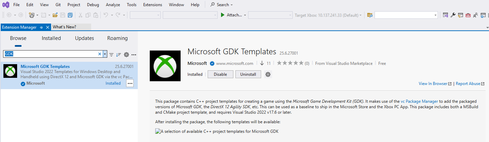
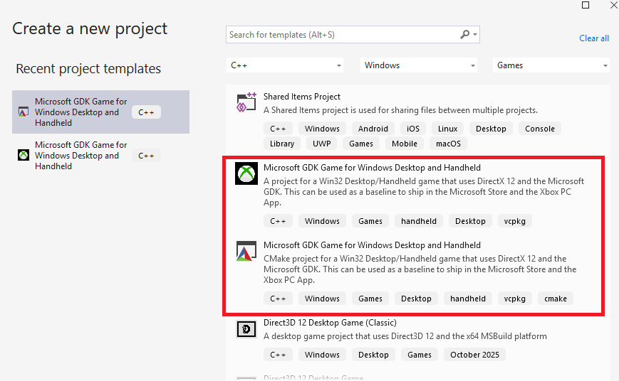

# Microsoft Game Development Kit (GDK)

Welcome to the Microsoft Game Development Kit (GDK) repository. This project aims to provide developers with the essential tools and resources to create amazing games for the Xbox ecosystem. Whether you're targeting PC, console, or cloud gaming, the GDK has you covered.

The GDK contains the common tools, libraries, and documentation needed to build games for [Xbox Game Pass for PC on Windows 10/11]( https://www.xbox.com/xbox-game-pass/pc-games?OCID=AID2100895_SEM_64cb82c395a51ebbffc2e27408836bc1:G:s&ef_id=64cb82c395a51ebbffc2e27408836bc1:G:s&msclkid=64cb82c395a51ebbffc2e27408836bc1), Xbox consoles (Xbox Series X|S, Xbox One), and [cloud gaming with Xbox Game Pass Ultimate](https://www.xbox.com/xbox-game-pass/cloud-gaming).

</br>

### ✨Key Features
•	**Comprehensive Toolset:** The GDK includes a wide range of tools and APIs to support game development across multiple platforms.

•	**Cross-Platform Development:** Develop games for Windows PCs, Xbox consoles, and cloud gaming with a single set of tools.

•	**Extensive Documentation:** Access detailed documentation, tutorials, and examples to help you make the most of the GDK.

</br>

### Quick Links
• [Install](#installation)

• [Samples & Documentation](#-docs--downloads)

• 🆕[Visual Studio Extension for GDK Development](#visual-studio-extension-for-gdk-development)


</br>

-----

## 🛠️Getting Started
### New to Game Development?
If you are new to game development and want to learn more, we recommend reviewing the [getting started](https://learn.microsoft.com/gaming/gdk/_content/gc/intro/overviews/welcome) documentation.  

</br>

### Installation
The GDK can be installed through the following methods:

####   WinGet ***[Recommended]***
WinGet, the Windows Package Manager, is a command-line tool that simplifies the installation process, enabling users to discover, install, upgrade, remove, and configure applications on Windows client computers.

It's particularly useful for automating installations and ensuring consistency across multiple machines.

This tool is the client interface to the Windows Package Manager service and it is bundled with Windows 11 and modern versions of Windows 10 by default.


> [!NOTE]
> •	See the [winget documentation](https://learn.microsoft.com/windows/package-manager/winget) for a list of system requirements and install instructions.
> </br> •	`winget` isn't available on Windows Server 2022 or earlier versions.
> </br> •	Windows Server 2025 Preview Build 26085 and later includes winget for Windows Server with Desktop Experience only.
</br>


The following commands can be used to install the GDK using the published winget packages:

##### Search for the latest version of the GDK
  ```
  winget search Microsoft.Gaming.GDK
  ```
</br>

##### Install the latest version of the GDK
  ```
  winget install Microsoft.Gaming.GDK
  ```

</br>

##### Upgrade to the latest version of the GDK
  ```sh
  winget upgrade Microsoft.Gaming.GDK
  ```

</br>
</br>


####  NuGet
[](https://www.nuget.org/packages/Microsoft.GDK.PC)
</br>
NuGet is a package manager for .NET that handles dependencies and versioning. It's beneficial for managing libraries and tools within Visual Studio projects. 

It also allows to ensure compatibility of the GDK with other packages in your project.

To install NuGet packages, you can use various methods such as the NuGet Package Manager in Visual Studio, the Package Manager Console, or the .NET CLI.

The NuGet package for the Microsoft GDK can be found here: https://www.nuget.org/packages/Microsoft.GDK.PC

To install it, you can follow these instructions:

1. **Open Visual Studio:** Start by launching your Visual Studio IDE.

2. **Create or Open a Project:** You can either create a new project or open an existing one. To create a new project, go to *File > New > Project*, select the type of project you want to create, and follow the prompts.

3. **Open NuGet Package Manager:** There are a few ways to open the NuGet Package Manager:
   - Right-click on your project in the Solution Explorer and select *Manage NuGet Packages....*
   - Go to *Tools > NuGet Package Manager > Manage NuGet Packages for Solution....*

4. **Browse for Packages:** In the NuGet Package Manager, go to the Browse tab and search for *Microsoft.GDK.PC*

5. **Install the Package:** Once you find the *Microsoft.GDK.PC* package, select it and click the *Install* button. Follow any prompts to complete the installation.

6. **Use the Package in Your Code:** After installing the package, you can use it in your code by adding the appropriate *using* statement at the top of your file and calling the package's API as needed.

</br>
</br>

####  GitHub
[](https://github.com/microsoft/GDK/releases/latest)
[]()
</br>


•	**Download:** Go to the Releases page and pick the latest and greatest. Alternatively, you can select the respective version required and download/extract the contents. 

•	**Install:** Run PGDK.EXE to launch the install wizard. If you have a previous version of the GDK you may need to uninstall that first.

</br>
</br>

### 📓Docs & Downloads
•	GDK documentation is here on docs.microsoft.com (DMC): [https://aka.ms/gamedevdocs](https://aka.ms/gamedevdocs)

•	Check out the Xbox public sample repository: [https://github.com/microsoft/Xbox-GDK-Samples/](https://github.com/microsoft/Xbox-GDK-Samples/)

•	Latest release of the GDK on GitHub: [https://aka.ms/gdk](https://aka.ms/gdk)


</br>


### 🆕Visual Studio Extension for GDK Development
The [Visual Studio Extension for GDK Development](https://marketplace.visualstudio.com/items?itemName=XboxGDK.Microsoft-GDK-Direct3DGame-Standalone) is now publicly available on the Visual Studio Marketplace. This extension provides two project templates designed to streamline the process of getting started with GDK development — allowing you to build a GDK game without needing to install the GDK itself.

Thanks to the availability of the GDK through [vcpkg](https://github.com/microsoft/vcpkg), an open-source C++ package manager, the templates automatically retrieve all necessary GDK components during project setup.

You can find the new templates using the Extension Manager in the Visual Studio UI:




Templates are available for both msbuild and cmake-based build systems. Once installed, simply create a new project and build!




Visual Studio Extension for GDK Development
https://img.shields.io/badge/Marketplace-Available-blue?logo=visualstudiocode](https://marketplace.visualstudio.com/) https://img.shields.io/github/license/your-org/your-repo](LICENSE) https://img.shields.io/github/actions/workflow/status/your-org/your-repo/build.yml?branch=main](https://github.com/your-org/your-repo/actions)

The Visual Studio Extension for GDK Development is now publicly available on the https://marketplace.visualstudio.com/. This extension includes two project templates that simplify the process of getting started with GDK development—enabling you to build a GDK game without installing the GDK itself.

Leveraging https://github.com/microsoft/vcpkg, an open-source C++ package manager, the templates automatically retrieve all required GDK components during project setup.

🚀 Key Features
No GDK installation required – all dependencies are pulled via vcpkg
Two project templates – supports both MSBuild and CMake-based build systems
Quick start – create a new project and build immediately
🧭 Getting Started
Open Visual Studio.
Navigate to Extensions > Manage Extensions.
Search for GDK Development and install the extension.
Create a new project using one of the provided templates.
Build and run—no additional configuration needed.
----

## What is the GDK?
•	The GDK is intended for developers learning about and onboarding into the Xbox ecosystem to build [Win32](https://docs.microsoft.com/windows/win32/) games for PC Game Pass on Windows 10/11.

•	The GDK is available to all developers free of charge, helping them learn how to build games for the Xbox App on Windows and Game Pass without requiring a license for learning.

•	The GDK can be used to publish through the [Xbox Creators Program](https://www.xbox.com/developers/creators-program) (registration required) .

•	Additional licensing is required to obtain the Xbox Extensions to build games optimized for Xbox consoles or publish games to the Microsoft catalog for any platform

</br>
More information can be found in our GDK public documentation. (http://aka.ms/gamedevdocs)

</br>
</br>

#### Note for Xbox Console Developers
A version of the GDK with Xbox Extensions (GDKX) to target Xbox consoles is only available to licensed partners in a managed program (https://aka.ms/gdkdl). 

</br>

----

## When to Use the GDK
Game development on Microsoft platforms has a history going back 40+ years which means that there have been and still are many options to build games that reach gamers on PC.  The GDK is an evolution to the Win32 legacy, to unify the app model between Xbox consoles, Windows PCs, and now Cloud Gaming to enable game developers to reach even more gamers on more devices, with less effort.  Microsoft Gaming Services are agnostic across many ecosystems and the GDK is sharing the app model across millions of devices.
</br>
### ❔How do I build next-generation games for the Xbox App on Windows 10/11 and Xbox Game Pass for PC?

-	[Get started setting up your developer environment here!](https://docs.microsoft.com/gaming/gdk/_content/gc/getstarted/dev-pc-setup)
-	Using [Win32 + GDK](https://docs.microsoft.com/gaming/gdk/_content/gc/get-started-with-pc-dev/overviews/gr-getting-started) is the primary, supported app model to build games for Xbox console, Xbox Game Pass (both Xbox and PC), and [Xbox Game Streaming](https://developer.microsoft.com/games/products/project-xcloud/)**.
-	Key Feature is that only Win32 + GDK fully supports all Microsoft Gameplay Services (Xbox Live identity, multiplayer, chat, leaderboards, achievements, commerce, etc.), and is *required for Xbox Game Pass[1] on both console and PC.*
-	[For developers building Win32 games on PC today](https://docs.microsoft.com/gaming/gdk/_content/gc/get-started-with-pc-dev/test-your-installation/gr-add-to-existing-project), Win32 + GDK builds on the Win32 C/C++ programming models to unify development across Xbox consoles and Windows PCs with the Microsoft Game Development Kit ([GDK](https://aka.ms/gdk)).

***[1] Requires software and licensing which is only available via an NDA Xbox program (e.g. [ID@Xbox program](https://developer.microsoft.com/games/publish/program-selection)).***

</br>
</br>

### ❔How do I run a GDK game built for the Xbox App on Windows 10/11 or Xbox Game Pass for PC on Xbox Consoles?

-	Xbox console development requires the “Microsoft Game Development Kit with Xbox Extensions (GDKX)”.  Games will need to retarget and rebuild for Xbox One or Xbox Series X|S with the GDKX installed.  
-	You need to download, install, and retarget your project for Xbox consoles using the GDKX
-	The GDKX is currently only available under confidential license within an NDA Xbox program (e.g. [ID@Xbox](https://developer.microsoft.com/games/publish/program-selection)).
-	The GDKX is just a bundled installer of the GDK + Xbox Extensions. Building a game with the GDK shares around ~80% of the same interfaces, but does not include the Xbox environment APIs and tools included in the Xbox Extensions.
-	The primary difference between games built with the GDK and the GDKX is the interaction with the Xbox graphics driver and DirectX12 Shader Compiler. 
-	For developers building Xbox One games, Win32 + GDK is a direct replacement for the WinRT-based Exclusive Resource Application (ERA) app model using the [XDK](https://docs.microsoft.com/gaming/xbox-live/get-started/setup-ide/managed-partners/vstudio-xbox/live-where-to-get-xdk), introduced on Xbox One; Xbox 360 developers similarly migrated to ERA in 2013.

</br>
</br>

### ❔How does the GDK compare to the Microsoft Universal Windows Platform (UWP)?

-	[The Universal Windows Platform](https://docs.microsoft.com/windows/uwp/gaming/e2e) was introduced in 2015 for Windows 10 as a bridge between all the devices in the Windows family (Windows Phone, Surface, Windows PCs, and Xbox One*).
-	Key feature for is open development and self-publishing to [Windows Mixed Reality (MR)](https://developer.microsoft.com/mixed-reality/) or the Microsoft Store on Windows 10 PCs and Xbox; particularly well suited for interactive media applications.
-	For developers building Win32 games today, UWP requires porting to the [WinRT programming model](https://docs.microsoft.com/windows/uwp/cpp-and-winrt-apis/intro-to-using-cpp-with-winrt)*.
-	UWP apps and games are community-supported only; partners inside Xbox managed programs (Xbox, Xbox Game Pass, Xbox Game Streaming) should use Microsoft Win32 + GDK.

</br>


----
## How the GDK is released

In the “When to use the GDK” section above, we cover the scenarios for which the GDK was designed to provide a modern app model that flows across Xbox consoles, Windows PCs, and Cloud Gaming.

In this section, we cover some of the more practical, basic questions that are also answered in the documentation, but come up frequently from developers getting started with this app model.

</br>
</br>

### ❔What is the public GDK release schedule?

- With the release of the April 2025 GDK, the release cadence changed from 3 major releases per year (March, June, and October) to 2 major releases per year (April and October). As part of this change, the servicing duration for each new major release has been extended from 12 months to 18 months. Continued support is provided to developers and partners when there’s a critical need to ship a GDK update, as has previously been the case.
-	GDK updates can release in parallel as needed, on separate branches, focused on reliability, stability, and fixes.  Developers can take updates vs. another major version to reduce churn and risk of breaking changes affecting compatibility (e.g. April Update #1, April Update #2, April Update #3, October Update #1, etc).

</br>
</br>

### ❔Where are detailed public release notes published?

-	A public version of the release notes can be found here: [GDK Release Notes](https://github.com/microsoft/GDK/releases)
- Change Log information is available to be reviewed here [Change Log](CHANGELOG.MD) as well as on the [Microsoft Learn](https://aka.ms/GdkWhatsNew) site.

</br>
</br>

### ❔What are some of key elements missing in the GDK that is needed to build games for Xbox consoles?

-	The Xbox developer environment APIs and Tools required to target and build games that run on Xbox consoles, currently only bundled as the GDKX installer package.
-	The Xbox graphics driver and related DirectX 12 components (e.g. Shader Compiler) required to build binaries that work with proprietary Xbox hardware and software interfaces.
-	The corresponding confidential documentation for Xbox environment APIs and Tools; though some topics are only discoverable with access to the GDKX, most topics are available as public docs (~60%) or are discoverable via the table of contents as a redirect to the confidential documentation libraries (~35%).  

</br>

----

### 🔗Looking for related resources to build and publish to Xbox consoles with the GDK**X**?

- Xbox console development is limited to licensed partners inside managed development programs, such as [ID@Xbox](https://developer.microsoft.com/games/publish)
- License and login required
  - GDKX (confidential program downloads): [https://aka.ms/gdkdl](https://aka.ms/gdkdl)
  - GDKX Documentation (secure): [https://aka.ms/gdkxdocs](https://aka.ms/gdkxdocs)
  - Xbox Developer Forums: [https://forums.xboxlive.com](https://forums.xboxlive.com)

